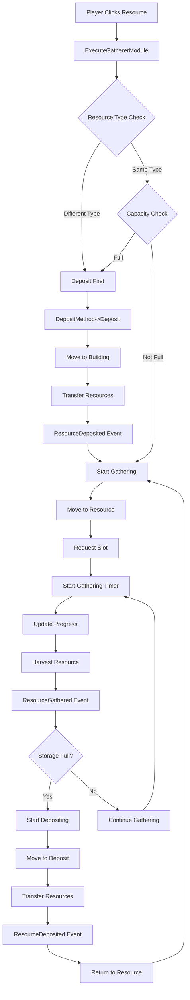

# 🏗️ GathererModule System

> **A modular, extensible resource gathering and depositing system for RTS units**

The GathererModule is the heart of resource management in the Drakthys RTS framework. It provides a sophisticated, strategy-based architecture that separates gathering logic from depositing logic, enabling flexible and extensible resource management behaviors.

## 🎯 System Overview

### Core Philosophy

The GathererModule follows the **Strategy Pattern** to provide maximum flexibility:

- **🎯 Separation of Concerns**: Gathering and depositing are completely separate strategies
- **🔧 Extensibility**: Easy to add new gathering or depositing behaviors
- **⚡ Modularity**: Each component has a single, well-defined responsibility
- **🔄 Event-Driven**: Clean event system for UI integration and feedback

### Architecture Diagram

```
GathererModule (Core Controller)
├── GatherMethod (Gathering Strategy)
│   ├── NormalGathering (Slot-based, timed gathering)
│   └── [Future: RadiusBasedGathering, QueueBasedGathering, etc.]
└── DepositMethod (Depositing Strategy)
    ├── InstantDeposit (0.2s delay, immediate resource transfer)
    └── NormalDeposit (Movement to building, then transfer)
```

## 🚀 Quick Start

### 1. Setup a Resource Actor

```cpp
// Add to your resource actor
UPROPERTY(EditAnywhere, BlueprintReadWrite, Instanced)
TObjectPtr<UGatherableModule> GatherableModule;

UPROPERTY(EditAnywhere, BlueprintReadWrite, Instanced)
TObjectPtr<USlotModule> SlotModule;
```

### 2. Setup a Unit Actor

```cpp
// Add to your unit actor
UPROPERTY(EditAnywhere, BlueprintReadWrite, Instanced)
TObjectPtr<UGathererModule> GathererModule;

UPROPERTY(EditAnywhere, BlueprintReadWrite, Instanced)
TObjectPtr<UTeamComponent> TeamComponent;
```

### 3. Configure the GathererModule

```cpp
// In Blueprint or C++
GathererModule->GatherMethod = CreateDefaultSubobject<UNormalGathering>(TEXT("GatherMethod"));
GathererModule->DepositMethod = CreateDefaultSubobject<UInstantDeposit>(TEXT("DepositMethod"));
GathererModule->MaxResourceStorage = 5;
```

### 4. Start Gathering

```cpp
// Execute gathering on a resource
GathererModule->ExecuteGathererModule(TargetResource);
```

## 🔄 Complete System Flow

### The Gather → Deposit → Gather Cycle



### State Management

The system maintains clear state transitions:

```cpp
enum class EGathererState : uint8
{
    Idle,       // No active operation
    Gathering,  // Currently gathering resources
    Depositing  // Currently depositing resources
};
```

## 🧩 Core Components

### 1. GathererModule (Main Controller)

**Purpose**: Central orchestrator that manages the complete gather → deposit → gather cycle.

**Key Responsibilities**:
- ✅ Manages unit resource state (`CurrentResourceAmount`, `CurrentResourceType`)
- ✅ Coordinates between gathering and depositing methods
- ✅ Handles resource type conflicts (deposit before gathering different types)
- ✅ Maintains target resource reference
- ✅ Broadcasts events for UI/feedback systems
- ✅ Centralizes movement management

**Core Functions**:
```cpp
// Entry point for gathering commands
void ExecuteGathererModule(ARTS_Actor* InTargetResource);

// Event handlers (called by methods)
void ResourceGathered(int32 ResourceAmount, EResourceType ResourceType);
void ResourceDeposited(int32 DepositedAmount, EResourceType ResourceType);

// Method transition API
void RequestDeposit();
void RequestContinueGather();

// Movement management
void MoveToLocation(FVector Location);
void StopMovement();
```

**State Properties**:
```cpp
UPROPERTY() TWeakObjectPtr<ARTS_Actor> TargetResource;
UPROPERTY() int32 CurrentResourceAmount = 0;
UPROPERTY() EResourceType CurrentResourceType;
UPROPERTY() int32 MaxResourceStorage = 1;
UPROPERTY() EGathererState CurrentState = EGathererState::Idle;
```

**Events**:
```cpp
// Broadcast when resources are gathered
FOnResourceGathered OnResourceGathered;

// Broadcast when resources are deposited  
FOnResourceDeposited OnResourceDeposited;

// Broadcast during gathering progress
FOnGatheringProgress OnGatheringProgress;
```

### 2. GatherMethod (Gathering Strategy)

**Purpose**: Abstract base class for different gathering behaviors. Handles movement, slot management, and gathering timing.

**Key Responsibilities**:
- ✅ Manages movement to resource locations
- ✅ Handles slot acquisition and release
- ✅ Controls gathering timing and progress
- ✅ Manages movement event bindings
- ✅ Provides virtual functions for customization

**Virtual Functions (Override These)**:
```cpp
// Main gathering entry point
virtual void Gather_Implementation(ARTS_Actor* ResourceTarget);

// Customize cleanup behavior
virtual void StopGather_Implementation();

// Customize gathering start logic
virtual void StartGathering();

// Customize gathering progress logic
virtual void TickGathering();

// Customize resource harvesting logic
virtual void CompleteGathering();
```

**Infrastructure Functions**:
```cpp
// Get slot from resource
bool RequestSlot(ARTS_Actor* ResourceTarget, FVector& OutSlotLocation);

// Release current slot
void ReleaseSlot();

// Move to specific location
void MoveToLocation(const FVector& TargetLocation);

// Manage movement callbacks
void BindMovementEvents();
void UnbindMovementEvents();
```

### 3. DepositMethod (Depositing Strategy)

**Purpose**: Abstract base class for different depositing behaviors. Handles movement to deposit locations and resource transfer.

**Key Responsibilities**:
- ✅ Manages movement to deposit buildings/locations
- ✅ Handles resource transfer to player resources
- ✅ Controls depositing timing and flow
- ✅ Manages movement event bindings
- ✅ Provides virtual functions for customization

**Virtual Functions (Override These)**:
```cpp
// Main depositing entry point
virtual void Deposit_Implementation(ARTS_Actor* Target);

// Customize cleanup behavior
virtual void StopDeposit_Implementation();

// Customize resource transfer logic
virtual void CompleteDepositing();

// Customize deposit location logic
virtual FVector GetDepositLocation();
```

## 📦 Current Implementations

### Gathering Methods

#### NormalGathering (GatherMethod_001)
**Behavior**: Slot-based gathering with timed resource harvesting.

**Flow**:
1. Request slot from target resource
2. Move to slot location
3. Start gathering timer
4. Update progress every 0.2s
5. Harvest resource when timer completes
6. Continue gathering or deposit if full

**Key Features**:
- Uses `SlotModule` for worker limiting
- Timer-based gathering with progress updates
- Automatic slot release on resource depletion
- Movement event binding/unbinding

**Configuration**:
- Gathering time from `GatherableModule->GatheringTime`
- 0.2s tick interval for progress updates
- 150 unit acceptance radius for movement

#### RadiusGathering (GatherMethod_002)
**Behavior**: Radius-based gathering without slot requirements.

**Flow**:
1. Move to random position within resource radius
2. Start gathering timer
3. Update progress every 0.2s
4. Harvest resource when timer completes
5. Continue gathering or deposit if full

**Key Features**:
- No slot requirements (unlimited workers)
- Random positioning within resource radius
- Timer-based gathering with progress updates
- Movement event binding/unbinding

### Deposit Methods

#### InstantDeposit
**Behavior**: Quick deposit with 0.2s delay for visual feedback.

**Flow**:
1. Start 0.2s timer
2. Transfer resources to player when timer expires
3. Reset unit resource state
4. Continue gathering cycle

**Key Features**:
- Minimal delay for visual feedback
- Direct resource transfer to `PlayerResourcesModule`
- No movement required
- Simple timer-based completion

#### NormalDeposit
**Behavior**: Movement-based deposit requiring travel to deposit building.

**Flow**:
1. Find deposit building (currently `RTS_PlayerStart`)
2. Move to building location
3. Transfer resources when movement completes
4. Reset unit resource state
5. Continue gathering cycle

**Key Features**:
- Building location detection
- Movement-based completion
- Automatic building finding
- Movement event handling

**Building Detection**:
- Searches for actors with class name containing "RTS_PlayerStart"
- Returns building location for movement
- Falls back to immediate completion if no building found

## 🔧 Configuration and Setup

### Required Modules

**For Resources**:
```cpp
// Defines resource properties (type, amount, gathering time)
UPROPERTY() TObjectPtr<UGatherableModule> GatherableModule;

// Manages worker slots (for slot-based gathering)
UPROPERTY() TObjectPtr<USlotModule> SlotModule;
```

**For Units**:
```cpp
// Main gathering controller
UPROPERTY() TObjectPtr<UGathererModule> GathererModule;

// For player ownership (required for resource access)
UPROPERTY() TObjectPtr<UTeamComponent> TeamComponent;
```

**For Player**:
```cpp
// Stores player resources
UPROPERTY() TObjectPtr<UPlayerResourcesModule> PlayerResourcesModule;
```

### Blueprint Setup

#### 1. Create Resource Actor
```cpp
// Add these components to your resource actor
UPROPERTY(EditAnywhere, BlueprintReadWrite, Instanced)
TObjectPtr<UGatherableModule> GatherableModule;

UPROPERTY(EditAnywhere, BlueprintReadWrite, Instanced)
TObjectPtr<USlotModule> SlotModule;
```

#### 2. Create Unit Actor
```cpp
// Add these components to your unit actor
UPROPERTY(EditAnywhere, BlueprintReadWrite, Instanced)
TObjectPtr<UGathererModule> GathererModule;

UPROPERTY(EditAnywhere, BlueprintReadWrite, Instanced)
TObjectPtr<UTeamComponent> TeamComponent;
```

#### 3. Configure GathererModule
```cpp
// In Blueprint or C++ initialization
GathererModule->GatherMethod = CreateDefaultSubobject<UNormalGathering>(TEXT("GatherMethod"));
GathererModule->DepositMethod = CreateDefaultSubobject<UInstantDeposit>(TEXT("DepositMethod"));
GathererModule->MaxResourceStorage = 5;
```

### Event Binding

**For UI/Feedback**:
```cpp
// Bind to gathering progress
GathererModule->OnGatheringProgress.AddDynamic(this, &YourClass::OnGatheringProgress);

// Bind to resource events
GathererModule->OnResourceGathered.AddDynamic(this, &YourClass::OnResourceGathered);
GathererModule->OnResourceDeposited.AddDynamic(this, &YourClass::OnResourceDeposited);
```

## 🎨 Creating Custom Methods

### Creating a New GatherMethod

1. **Create Header File**:
```cpp
#pragma once
#include "GatherMethod.h"
#include "YourNewGathering.generated.h"

UCLASS(DisplayName = "Your Custom Gathering", 
       ToolTip = "Custom gathering behavior with unique features")
class DRAKTHYSPROJECT_API UYourNewGathering : public UGatherMethod
{
    GENERATED_BODY()

public:
    virtual void Gather_Implementation(ARTS_Actor* ResourceTarget) override;
    virtual void StopGather_Implementation() override;
    virtual void StartGathering() override;
    virtual void TickGathering() override;
    virtual void CompleteGathering() override;

private:
    // Add your custom properties
    UPROPERTY(EditAnywhere, Category = "Custom Gathering")
    float CustomGatheringTime = 1.0f;
};
```

2. **Implement Key Functions**:
```cpp
void UYourNewGathering::Gather_Implementation(ARTS_Actor* ResourceTarget)
{
    // Call base for module setup
    Super::Gather_Implementation(ResourceTarget);
    
    // Your custom gathering logic
    // Example: No slots needed, just move to resource
    FVector ResourceLocation = ResourceTarget->GetActorLocation();
    BindMovementEvents();
    MoveToLocation(ResourceLocation);
}

void UYourNewGathering::StartGathering()
{
    // Your custom gathering start
    CurrentGatheringTime = 0.f;
    RequiredGatheringTime = CustomGatheringTime;
    
    // Start timer
    GathererModule->GetWorld()->GetTimerManager().SetTimer(
        GatheringTimer, 
        this, 
        &UYourNewGathering::TickGathering, 
        0.2f, 
        true
    );
}

void UYourNewGathering::CompleteGathering()
{
    // Your custom completion logic
    // Don't forget to harvest the resource!
    bool bHarvested = false;
    int32 OutAmount = 0;
    EResourceType OutType;
    
    GatherableModule->HarvestResource(1, bHarvested, OutAmount, OutType);
    
    if (bHarvested) {
        GathererModule->ResourceGathered(OutAmount, OutType);
    }
}
```

### Creating a New DepositMethod

1. **Create Header File**:
```cpp
#pragma once
#include "DepositMethod.h"
#include "YourNewDeposit.generated.h"

UCLASS(DisplayName = "Your Custom Deposit", 
       ToolTip = "Custom deposit behavior with unique features")
class DRAKTHYSPROJECT_API UYourNewDeposit : public UDepositMethod
{
    GENERATED_BODY()

public:
    virtual void Deposit_Implementation(ARTS_Actor* Target) override;
    virtual void StopDeposit_Implementation() override;
    virtual void CompleteDepositing() override;
    virtual FVector GetDepositLocation() override;

private:
    // Add your custom properties
    UPROPERTY(EditAnywhere, Category = "Custom Deposit")
    float CustomDepositTime = 0.5f;
};
```

2. **Implement Key Functions**:
```cpp
void UYourNewDeposit::Deposit_Implementation(ARTS_Actor* Target)
{
    // Your custom deposit logic
    // Example: Timer-based deposit
    if (GathererModule && GathererModule->GetWorld()) {
        GathererModule->GetWorld()->GetTimerManager().SetTimer(
            DepositTimer, 
            this, 
            &UYourNewDeposit::CompleteDepositing, 
            CustomDepositTime, 
            false
        );
    }
}

FVector UYourNewDeposit::GetDepositLocation()
{
    // Your custom location logic
    // Example: Find nearest building
    return FindNearestBuildingLocation();
}

void UYourNewDeposit::CompleteDepositing()
{
    // Your custom completion logic
    // Don't forget to transfer resources!
    if (!GathererModule || !GathererModule->Owner) return;
    
    UPlayerResourcesModule* PlayerResources = URTSModuleFunctionLibrary::GetPlayerResources(GathererModule->Owner);
    if (!PlayerResources) return;
    
    if (GathererModule->CurrentResourceAmount > 0) {
        PlayerResources->AddResource(GathererModule->CurrentResourceType, GathererModule->CurrentResourceAmount);
        GathererModule->ResourceDeposited(GathererModule->CurrentResourceAmount, GathererModule->CurrentResourceType);
    }
}
```

## 🛠️ Best Practices

### 1. Resource Management
- ✅ Always check for null pointers before accessing modules
- ✅ Use `URTSModuleFunctionLibrary` for safe module access
- ✅ Handle resource depletion gracefully
- ✅ Validate module initialization order

### 2. Movement Management
- ✅ Always bind/unbind movement events when needed
- ✅ Clear timers in stop functions
- ✅ Handle movement failures gracefully
- ✅ Use centralized movement through GathererModule

### 3. State Management
- ✅ Keep state consistent between gathering and depositing
- ✅ Reset state properly in stop functions
- ✅ Use weak pointers for external references
- ✅ Validate state transitions

### 4. Error Handling
- ✅ Log warnings for missing components
- ✅ Provide fallback behaviors for edge cases
- ✅ Don't let errors break the gathering cycle
- ✅ Use proper error recovery mechanisms

### 5. Performance
- ✅ Use timers sparingly (0.2s intervals are good)
- ✅ Cache frequently accessed components
- ✅ Avoid expensive operations in tick functions
- ✅ Optimize movement and pathfinding

## 🔍 Troubleshooting

### Common Issues

#### 1. Unit not gathering
**Symptoms**: Unit moves to resource but doesn't start gathering
**Causes**:
- Missing `GatherableModule` on resource
- Missing `SlotModule` on resource (for slot-based gathering)
- Invalid `GatherMethod` initialization
- No available slots

**Solutions**:
```cpp
// Check if modules are present
UGatherableModule* Gatherable = URTSModuleFunctionLibrary::GetGatherableModule(Resource);
USlotModule* Slots = URTSModuleFunctionLibrary::GetSlotModule(Resource);

if (!Gatherable || !Slots) {
    UE_LOG(LogTemp, Warning, TEXT("Resource missing required modules"));
    return;
}
```

#### 2. Unit not depositing
**Symptoms**: Unit gathers resources but doesn't deposit them
**Causes**:
- Missing `PlayerResourcesModule` on player state
- Invalid `DepositMethod` initialization
- Deposit location not found
- Resource transfer failure

**Solutions**:
```cpp
// Check if player resources module is accessible
UPlayerResourcesModule* PlayerResources = URTSModuleFunctionLibrary::GetPlayerResources(Unit);
if (!PlayerResources) {
    UE_LOG(LogTemp, Warning, TEXT("Player resources module not found"));
    return;
}
```

#### 3. Infinite loops
**Symptoms**: Unit gets stuck in gather/deposit cycle
**Causes**:
- `CurrentResourceAmount` not properly reset
- `TargetResource` becomes invalid
- Stop functions not called when needed
- State management issues

**Solutions**:
```cpp
// Ensure proper state reset
void UGathererModule::ResourceDeposited(int32 DepositedAmount, EResourceType ResourceType)
{
    CurrentResourceAmount = 0;  // Always reset
    CurrentState = EGathererState::Idle;
    OnResourceDeposited.Broadcast(ResourceType, DepositedAmount);
}
```

#### 4. Movement issues
**Symptoms**: Unit doesn't move or moves incorrectly
**Causes**:
- Missing `AIController` or `PathFollowingComponent`
- Movement events not properly bound/unbound
- Incorrect acceptance radius settings
- Pathfinding failures

**Solutions**:
```cpp
// Verify movement components
AAIController* AIController = Cast<AAIController>(Owner->GetController());
UPathFollowingComponent* PathComp = AIController ? AIController->GetPathFollowingComponent() : nullptr;

if (!AIController || !PathComp) {
    UE_LOG(LogTemp, Warning, TEXT("Missing movement components"));
    return;
}
```

### Debug Tips

#### 1. Enable debug logging
```cpp
// Set debug flags
bDrawDebugPath = true;  // Visualize movement paths
bEnableDebugLogging = true;  // Enable detailed logging
```

#### 2. Check module states
```cpp
// Verify all required modules are present
void UGathererModule::ValidateModules()
{
    if (!GatherMethod) UE_LOG(LogTemp, Warning, TEXT("GatherMethod is null"));
    if (!DepositMethod) UE_LOG(LogTemp, Warning, TEXT("DepositMethod is null"));
    if (!Owner) UE_LOG(LogTemp, Warning, TEXT("Owner is null"));
}
```

#### 3. Monitor events
```cpp
// Bind to all events for debugging
GathererModule->OnResourceGathered.AddDynamic(this, &YourClass::OnResourceGathered);
GathererModule->OnResourceDeposited.AddDynamic(this, &YourClass::OnResourceDeposited);
GathererModule->OnGatheringProgress.AddDynamic(this, &YourClass::OnGatheringProgress);
```

## 🚀 Future Enhancements

### Planned Features

#### 1. Advanced Gathering Methods
- **QueueBasedGathering** - Wait in line for slots
- **FormationGathering** - Organized worker positions
- **MultiResourceGathering** - Gather multiple resource types simultaneously

#### 2. Advanced Deposit Methods
- **BuildingSpecificDeposit** - Different buildings for different resources
- **CaravanDeposit** - Group deposit with movement
- **RemoteDeposit** - Deposit without returning to base

#### 3. System Improvements
- **Resource queuing system** - Queue multiple resources
- **Dynamic slot allocation** - Smart slot management
- **Performance optimizations** - Better pathfinding and caching
- **Advanced error recovery** - Robust failure handling

### Extension Points

#### 1. Custom Resource Types
```cpp
// Extend EResourceType enum
UENUM(BlueprintType)
enum class EResourceType : uint8
{
    Wood,
    Stone,
    Gold,
    Food,
    // Add your custom types here
    CustomResource1,
    CustomResource2
};
```

#### 2. Custom Building Types
```cpp
// Extend GetDepositLocation() for building types
FVector UCustomDeposit::GetDepositLocation()
{
    // Find specific building type for this resource
    return FindBuildingByResourceType(CurrentResourceType);
}
```

#### 3. Custom Movement Behaviors
```cpp
// Override movement functions for custom pathfinding
void UCustomGathering::MoveToLocation(const FVector& TargetLocation)
{
    // Custom pathfinding logic
    // Formation movement
    // Obstacle avoidance
}
```

---

## 📚 Related Documentation

- **[GatherMethod README](./GatherMethod/README.md)** - Detailed guide for gathering strategies
- **[DepositMethod README](./DepositMethod/README.md)** - Detailed guide for depositing strategies
- **[System Architecture](./log/SYSTEM_ANALYSIS.md)** - Deep dive into system design
- **[Issue Tracking](./log/TODO.md)** - Current issues and improvements

---

*This documentation covers the complete GathererModule system. For specific implementation details, refer to the individual class files and their inline documentation.*
